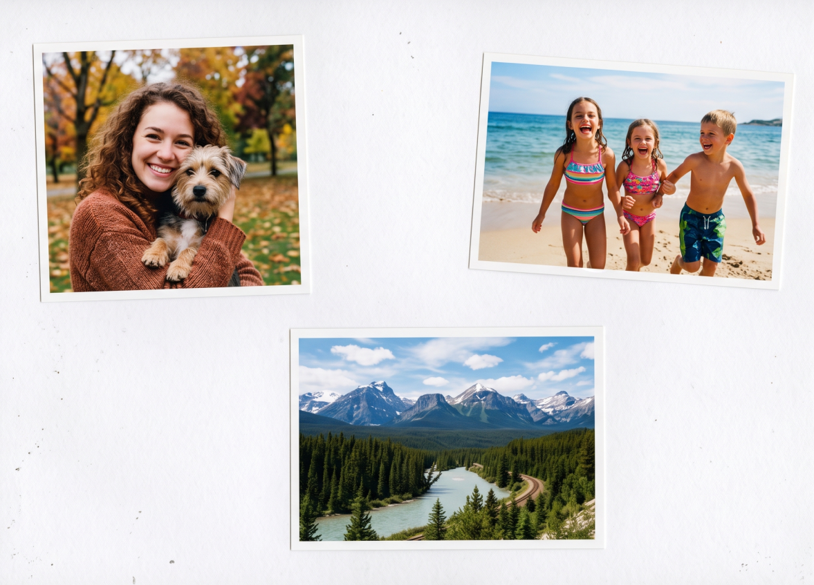
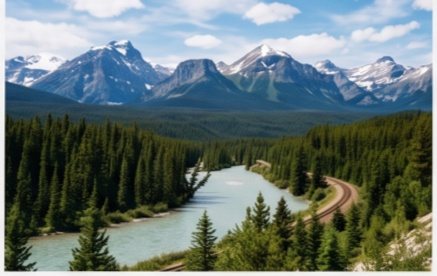
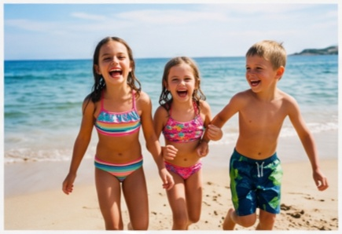
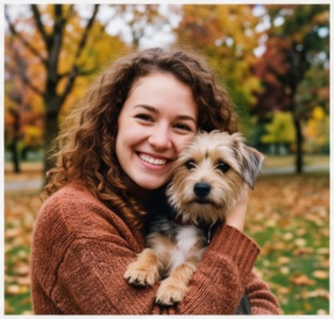

# 📸 PhotoOPS

> Automated photo separation and deskewing tool — turns a single scanned image containing multiple tilted pictures into perfectly straightened, individually cropped JPEGs.

PhotoOPS uses OpenCV to detect, rotate, and crop every photograph found inside a flatbed scan (or any image) into its own file, correcting the angle so each shot comes out straight and ready to share.

---

## ✨ What it does

When you place several printed photos on a scanner at once and hit scan, you get one big image with everything in it — and they're almost never aligned. PhotoOPS solves that in one command:

1. 🔍 **Detects** every external contour in the scan.
2. 📐 **Deskews** each detected photo by computing its minimum-area rotated rectangle and un-rotating it.
3. ✂️ **Crops** the straightened photo from the original image with sub-pixel accuracy.
4. 💾 **Saves** each result as a numbered JPEG (`<basename>-1.jpg`, `<basename>-2.jpg`, …).

---

## 🖼️ Example

### Input

A single scan (`example.png`) containing three slightly rotated photos:

<p align="center">
  
</p>

### Output

Running:

```bash
python photoops.py example.png
```

produces three automatically deskewed, individually cropped photos:

<p align="center">
  
  
  
</p>

<p align="center">
  <em><b>example-1.jpg</b> — 437 × 276 px &nbsp;·&nbsp; <b>example-2.jpg</b> — 435 × 298 px &nbsp;·&nbsp; <b>example-3.jpg</b> — 373 × 357 px</em>
</p>

The console reports each saved file, its pixel size, and the corrected angle, e.g.:

```
Starting PhotoOPS on: example.png
Saved: separated_photos/example-1.jpg | Size: 437x276 px | Angle corrected: -3.42°
Saved: separated_photos/example-2.jpg | Size: 435x298 px | Angle corrected: 1.87°
Saved: separated_photos/example-3.jpg | Size: 373x357 px | Angle corrected: -5.13°
PhotoOPS process finished. Found and deskewed 3 photos.
```

---

## 📦 Installation

Requires **Python 3.8+**.

```bash
python -m venv .venv
source .venv/bin/activate   # On Windows: .venv\Scripts\activate
pip install -r requirements.txt
```

The only dependency is [`opencv-python`](requirements.txt).

---

## 🚀 Usage

```bash
python photoops.py <image_path> [-o OUTPUT_DIR]
```

### Arguments

| Argument | Description |
| -------- | ----------- |
| `image_path` | Path to the scanned image file (required). |
| `-o`, `--output` | Output directory for separated photos. Defaults to `separated_photos`. |

### Examples

```bash
# Use default output directory
python photoops.py example.png

# Custom output directory
python photoops.py scans/summer_2024.jpg -o out/summer_2024

# Help
python photoops.py -h
```

---

## ⚙️ How it works

The pipeline runs entirely with OpenCV (no ML models, no GPU):

1. **Load** the original color image.
2. **Preprocess**: convert to grayscale and apply a Gaussian blur to reduce noise.
3. **Edge detection** with Canny (50, 150).
4. **Dilate** the edges to close small gaps in contours.
5. **Find external contours** with `cv2.RETR_EXTERNAL`.
6. For each contour large enough (`min_area = 50000` px² by default):
   - Compute the **minimum-area rotated rectangle** (`cv2.minAreaRect`).
   - **Normalize the angle** (folding it into a [-45°, 45°] range by swapping width/height when needed) to avoid stretching the photo.
   - **Warp** the original image around the contour centroid.
   - **Crop** the straightened region with `cv2.getRectSubPix`.
   - **Save** it as a JPEG.

### Tuning

If too few or too many photos are detected, tweak the `min_area` constant near the top of `photo_ops_process()` in [`photoops.py`](photoops.py). Lower values catch smaller photos; raise it to ignore dust or scanner artifacts.

---

## 📄 License

Released under the [MIT License](LICENSE) — © 2026 Mauro Cendon Hidalgo.
